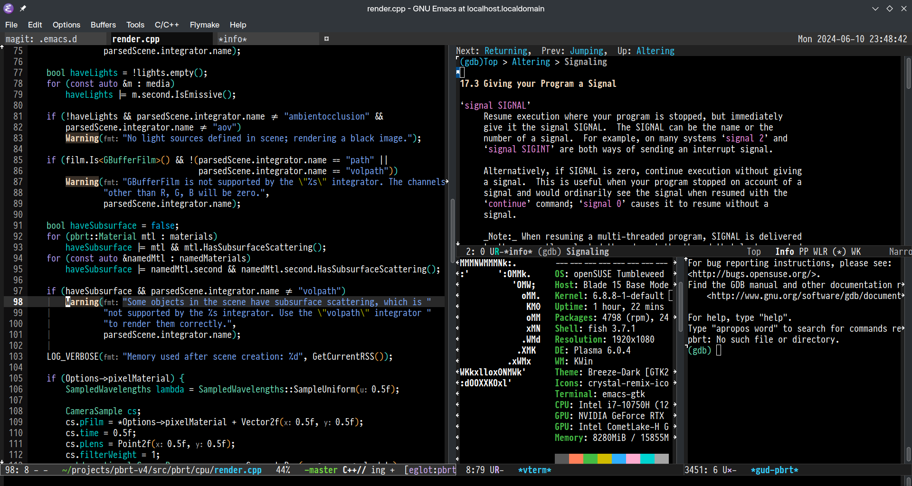

# 42yeah's .emacs.d 

This config is based on [Emacs Bedrock](https://codeberg.org/ashton314/emacs-bedrock), and then tailored to my personal taste. Emacs Bedrock is great because it offered a strong template to build from, and I recommend everyone to use it if they want to build their own.
My main motivations are a more finer grained control over the editor, and an Emacs config that is my own. Some configs are merged from [Purcell's .emacs.d](https://github.com/purcell/emacs.d), and some are based on my own (admittedly weird) aesthetic sense. Some (not all) features are listed below.



## Getting Started

To use my config, 

```sh
git clone https://github.com/42yeah/emacs.d .emacs.d
```

Now some people with sharp eyes might've noticed the dot, or the lack thereof. And to that, I say "Well I forgot, OK?? And I am too lazy to change it now."

## Features 

The [base.el](https://codeberg.org/ashton314/emacs-bedrock/src/branch/main/extras/base.el) and [dev.el](https://codeberg.org/ashton314/emacs-bedrock/src/branch/main/extras/dev.el) are enabled by default, with a few quality-of-life improvements, ranked by their notability.

*Keyboard `pixel-scroll-mode`*. The keyboard-based [`pixel-scroll-mode`](https://www.gnu.org/software/emacs/manual/html_node/efaq/New-in-Emacs-29.html) is used to decrease disorientation during Emacs navigation. The code is stolen from [u/JosephFerano](https://www.reddit.com/r/emacs/comments/wx7ytn/emacs_29_native_smooth_scrolling/) and modified to my liking. `C-v` smoothly scrolls half the screen, while `C-V` scrolls 1/4 of the screen for more fine-grained keyboard based control and interpolation. You will find that shift modifier key often offers more fine-grained and precise control for the same functionality in this config. Also using `pixel-scroll-precision-interpolate` means there will be no external dependencies. The same goes for `M-v` and `M-V`. 

*Window manipulation improvements*. For example, while splitting window sideways and vertically, the other window always show the other buffer. Taken from [purcell/emacs.d](https://github.com/purcell/emacs.d/blob/adf0e27c95cae4e19e2fee174170bac2ff7e83d3/lisp/init-windows.el#L25). I found this to be insanely useful during code editing. Likewise, `C-S-<UP>, C-S-<DOWN>, C-S-<LEFT>, C-S-<RIGHT>` now swaps windows around, because its certainly nice to have.

*Editing and navigational enhancements*. [`avy-goto-char`](https://github.com/abo-abo/avy) is rebound to `C-j` to stay firmly in the home row, while `avy-goto-char-2` is `C-J`. `avy-goto-char-timer` is on `M-j`. `whole-line-or-region` is an extra package which allows line deletion using `C-w` when there is no active region. This is an *insane* QoL improvement and I use it so much. [`beacon`](https://github.com/Malabarba/beacon) is a package which tracks cursor movement. Though unmaintained, I chose it over [`pulsar`](https://protesilaos.com/emacs/pulsar) because it's more pretty. [`symbol-overlay`](https://github.com/wolray/symbol-overlay) is used to enable `M-n` and `M-p` symbol jumping.

*Aesthetic improvements*. [`smart-mode-line`](https://github.com/Malabarba/smart-mode-line) is used to replace the default modeline because I think it's cleaner and less cluttered. Also it feels cooler due to the color choices. [`rainbow-delimiters`](https://github.com/Fanael/rainbow-delimiters) and [`indent-guide`](https://github.com/zk-phi/indent-guide) are used for an overall better editing experience, however I suppose some people may prefer [`highlight-indent-guides`](https://github.com/DarthFennec/highlight-indent-guides). `prog-mode` now automatically truncates text.

*Miscellaneous*. Below are a few more notable modifications:

1. [Eglot](https://github.com/joaotavora/eglot) automatically starts for the following mode: `c++-ts-mode`, `c-ts-mode`, `python-ts-mode`, `c-mode`. 
2. `treesit-language-source-alist` is now defined so that `treesit-install-language-grammar` works. This part of code comes from [Mickey Petersen](https://www.masteringemacs.org/article/how-to-get-started-tree-sitter).
3. Various new modes: `cmake-mode`, `yaml-mode`, `markdown-mode`, etc. 
4. My own customizations are left inside. 
5. More consult keymaps are bound to their keys according to the manual. 
6. [`pragmatapro-lig.el`](https://github.com/lumiknit/emacs-pragmatapro-ligatures/blob/master/pragmatapro-lig.el) is incorporated because I use [Pragmata Pro](https://fsd.it/shop/fonts/pragmatapro/) and I love ligatures. 

## Conclusion

In this repository, I proposed a novel dot emacs config that is based on Emacs Bedrock. The number of new packages are minimal to reduce bloat and accelerate load time - only 0.99153s on my OpenSUSE as reported by `emacs-init-time`. An overall more fine-grained control and keymap is applied, together with a few aesthetic improvements. Experiments shows that I love this config. 
